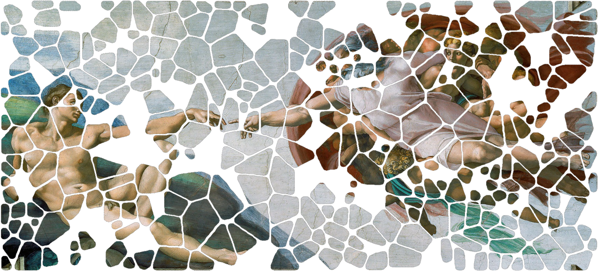
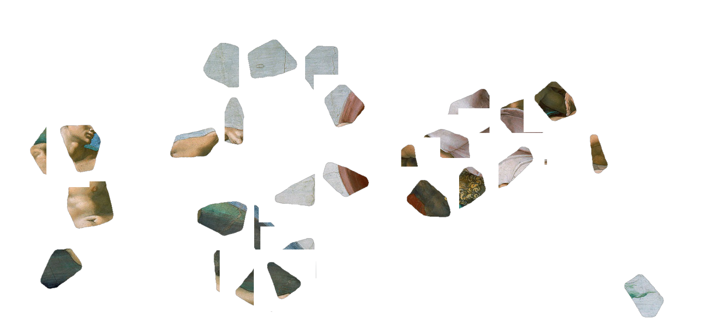

# TP1 Traitement d'image [LEBORGNE-SEBIROT]

## Partie 1

### Énoncé

L’objectif du premier exercice est de reconstruire une image de fresque à partir d’un ensemble defragments, et de leurs positions correctes à l’intérieur de l’image initiale. Chaque fragment a un indexindex≥0, et sa représentation se trouve dans le fichierfrag_eroded_`<index>`.png. Dans le fichierfragments.txton fournit ligne par ligne les positions de tous les fragments qui font réellement partiede la fresque, dans le format :`<index>` `<posx>` `<posy>` `<angle>`Le fichierfragments_s.txt dévoile les indices des fragments qui ne font pas partie de la fresque, et quiont été rajoutés juste pour mettre en difficulté un éventuel algorithme de reconstruction automatique.Votre premier objectif sera donc de comprendre la signification exacte des valeurs contenues enfragments.txt, et de les utiliser pour créer à partir des fragments l’image suivante (Figure 1), qui devra avoir la même résolution que l’image initiale de la fresque (fournie).

### Réalisation

Pour la réalisation de cette partie du TP nous avons suivie les étapes suivantes :

1. ouverture du fichier contenant les fragments (fragments.txt), à l'aide de la librairie fstream
2. création d'une fresque vierge de la même dimensions que l'original
3. pour chaque fragment contenue dans `fragment.txt` on à alors :

   * chargé l'image du fragment
   * effectuer sa rotation
   * cacluler ses coordonné
   * et enfin copier le fragment à la bonne position tout en détourant les contour à l'aide du canal alpha des fragments.
4. on a ensuite sauvegardé l'image avant de l'afficher.

   Résulat de notre programme de reconstruction :

   

### Utilisation de notre programme de reconstruction

* Se placer dans le repertoire du projet : path/TP1_TI/partie_1
* construire l'executable : `make tp1-1`
* lancer l'executable : `./tp1-1`
* l'image de la fresque reconstruite doit réappariatre dans le dossier partie 1

## Partie 2

### Énoncé

En réalité, un compétiteur qui souhaite faire une reconstruction automatique construit un fichier delocalisation des fragmentssolution.txtayant la même structure quefragments.txt, sans jamaisavoir accès afragments.txtévidemment. Implémentez un programme qui calcule la qualité de lareconstruction desolution.txten la confrontant au contenu de la vérité terrain qui se trouve enfragments.txt.Pour cela on considère qu’un fragmentiqui est positionné à(x,y,α)et qui dans la vérité terrain setrouve réellement à( ̄x, ̄y, ̄α)est bien localisé si :‖x− ̄x‖≤∆x,‖y− ̄y‖≤∆yet‖α− ̄α‖≤∆α.On calcule la précisionpde la localisation comme la surface de tous les fragments bien localisés, moinsla surface des fragments positionnés mais n’appartenant pas à la fresque, divisée par la surface de tousles fragments de la fresque.Les valeurs∆x,∆y,∆αdoivent rester des paramètres de votre programme ; mais typiquement ellespourraient prendre la valeur de 1px, 1px et 1 deg respectivement.Testez votre programme d’évaluation avec quelques fichierssolution.txtsimples.Sep. 20221

### Réalisation

Pour la réalisation de cette partie du Tp nous avons réaliser les étaps suivantes :

1. lecture et et placement des données des fichiers fragments.txt et solution.txt dans des vectors
2. On parcourt les tableaux et dès que l'on observe qu'il s'agit du même fragment :
   * On rajoute le morceaux de fresque à la surface total de la fresque
   * on verifie si le fragment et bien localisé et si oui on rajoute la surface totales des fragment bien localisé
   * si le fragment ne fait pas partie de la fresque on rajoute sa surface à la surface totales des frgmant placé à tort dans la fresque.
3. On affiche chaque surface calculé
4. Avant de montrer la précision de la localisation du fichier de solutions.

### Utilisation de notre programme de notation

* Se placer dans le repertoire du projet : path/TP1_TI/partie_2
* construire l'executable : `make tp1-2`
* lancer l'executable : `./tp1-2`

## Principales difficulté rencontrées

Durant ce TP nous avons rencontrés deux principaux problémes : les deux sont liés à la copie puis au pacement des fragments de la fresque dans la première partie.

### Probléme de copie des fragments

Le premier probléme rencontrer concernait la copie des fragments en effet lors de la première itération de notre programme les fragmment étant recopier sans être détouré ce qui donnait un resulat comme l'image ci-dessous :

Nous avons résolus le probléme en changeant le type de la variables de stockage de l'image afin qu'elle comprenne le canal alpha de l'image.

### Probléme de positionnement des fragment 

Le second probléme rencontrer à été le placement des fragment, en effet lorque l'on utilisait la fonction de opencv : `.copyTo()` il semblerait que certainnes parties des fragments étaient copier à l'extérieur de la fresque, ce qui entrainiat une erreur lors du runtime de notre fonction. Nous avons résolue ce problémes en copiant chaque pixel à la place d'utiliser la fonction dejà existante de opencv.
